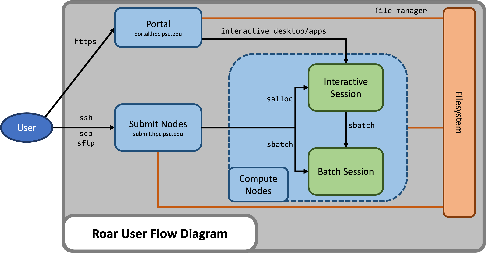

# Overview


## About ICDS

The [Institute for Computational and Data Sciences (ICDS)](https://www.icds.psu.edu/) is one of seven interdisciplinary research institutes within Penn State's Office of the Senior Vice President for Research. 
The mission of ICDS is to build capacity to solve problems of scientific and societal importance through cyber-enabled research. 
ICDS enables and supports the diverse computational and data science research taking place throughout Penn State.

ICDS provides university faculty, staff, students, and collaborators access to Roar, which consists of the **Roar Collab (RC)** and **Roar Restricted (RR)** research computing clusters. 
Roar Collab is the flagship computing cluster for Penn State researchers. 
Access to Roar Restricted is provided on an as-needed basis to research groups specifically handling restricted data. 
Most of the material within this ICDS User Guide is common to both Roar Collab and Roar Restricted, but some sections may specifically refer to Roar Collab. 
The [Roar Restricted Addendum](06_RoarRestricted.md) specifically addresses items unique to Roar Restricted.


[//]:<> (## High-Performance Computing Overview)

[//]:<> (High-performance computing _HPC_ is the use of powerful computing systems that are capable of performing complex tasks and solving large-scale computational problems at significantly higher speeds and with greater efficiency than conventional computing systems. These tasks often involve processing and analyzing massive datasets, conducting simulations, modeling complex phenomena, and executing advanced algorithms. The increase in computational performance is a result of the aggregation of computing resources and utilizing those resources in concert to perform the computational process. HPC systems consist of many compute nodes that communicate over fast interconnections. Each node contains many high-speed processors and its own memory. Typically, the nodes also are connected to a shared filesystem. The seamless integration of the compute, storage, and networking components at a large scale is the fundamental essence of HPC. HPC plays a critical role in pushing the boundaries of academic research and enabling breakthroughs in science, engineering, and technology across diverse fields of study.)


## Shared Computing Clusters

A computing cluster is a group of interconnected computers that work together to perform computational tasks. 
Each of these computers, referred to as a **node**, typically consists of its own processor(s), memory, and network interface. 
Often these nodes are additionally connected to a shared filesystem so data is available to all of the nodes. 
Nodes can be used individually but can also be utilized collectively to perform demanding computational processes more efficiently. 
Integrating the separate nodes into a single system requires a suite of cluster management software that is configured and implemented by system administration personnel.

The research computing clusters offered by ICDS are shared computational resources, so the computational processes must be managed to allow for many simultaneous users. 
To perform computationally intensive tasks, users must request compute resources and be provided access to those resources to perform the tasks. 
A computational process or workflow run via the request and provision of computational resources is typically referred to as a computational **job**.
The request and provision process allows the tasks of many users to be scheduled and carried out efficiently to avoid resource contention. 

The software tasked with managing the scheduling of computational resources is often referred to as the **resource manager** or the **job scheduler**.
Shared computing clusters are often configured to mediate access to its pool of computational resources not only through the use of a resource manager, but also by the cluster architecture.
From an architectural perspective, in addition to the set of compute nodes that act as the pool of computational resources, a cluster often utilizes a set of nodes that specifically handle user logins and then also has other auxiliary nodes used for specific system administration functions.
A user typically connects to a login-type node, and then requests computational resources via the resource management software. A node that is configured to handle user logins and the submission of resource requests is referred to as a **submit node**, while a node used for computationally intensive tasks is referred to as a **compute node**.


## Slurm

[Slurm (Simple Linux Utility for Resource Management)](https://slurm.schedmd.com/documentation.html) is the software that acts as the job scheduler and resource manager.
Slurm is an open source, fault-tolerant, and highly scalable cluster management and job scheduling system for Linux clusters. Its primary functions are to

 - Allocate access to compute resources to users for some duration of time
 - Provide a framework for starting, executing, and monitoring work on the
set of allocated compute resources
 - Arbitrate contention for resources by managing a queue of pending work

Slurm is rapidly rising in popularity and many other computing clusters use Slurm as well. The [Submitting Jobs](03_SubmittingJobs.md) section provides further detail on the use of Slurm on Roar, and [Slurm's documentation](https://slurm.schedmd.com/documentation.html) is a great resource for in-depth details on the usage of Slurm.


### Slurm's `sinfo` Command

The ICDS research computing clusters are heterogeneous and somewhat dynamic. To see the different node configurations available, use the following command:

```
sinfo --Format=features:40,nodelist:20,cpus:10,memory:10
```

This `sinfo` command displays not only the core and memory configuration of the nodes, but it also indicates the processor generation associated with each node. Furthermore, while connected to a specific node, the `lscpu` command provides more detailed information on the specific processor type available on the node. The first column of the output lists the features associated with each block of nodes

To add a column to the `sinfo` command output that indicates the number of GPU(s) associated with each of the node blocks, simply add the `gres` option to the `sinfo` format string:

```
sinfo --Format=features:40,nodelist:20,cpus:10,memory:10,gres:10
```

On a GPU node, running the `nvidia-smi` command displays more detailed information on the GPU(s) available on that node.

Slurm's [sinfo](https://slurm.schedmd.com/sinfo.html) documentation page provides a detailed description of the function and options of the `sinfo` command.


## System Specs


Roar is comprised of two distinct research computing clusters. 
The **Roar Collab (RC)** and **Roar Restricted (RR)** system specifications are described below. 


### Roar Collab

Roar Collab (RC) is the flagship computing cluster for Penn State researchers. 
Designed with collaboration in mind, the RC environment allows for more frequent software updates and hardware upgrades to keep pace with researchers’ changing needs. 
RC utilizes the Red Hat Enterprise Linux (RHEL) 8 operating system to provide users with access to compute resources, file storage, and software. RC is a heterogeneous computing cluster comprised of different types of compute nodes, each of which can be categorized as a Basic, Standard, High-Memory, GPU, or Interactive node.

| Node Type<br>(Designation) | Core/Memory<br>Configurations | Description |
| :----: | :----: | ---- |
| Basic<br>(`bc`) | 24 cores, 128 GB<br>64 cores, 256 GB | Connected via Ethernet<br>Configured to offer about 4 GB of memory per core<br>Best used for single-node tasks |
| Standard<br>(`sc`) | 24 cores, 256 GB<br>48 cores, 380 GB<br>48 cores, 512 GB | Connected via Infiniband and Ethernet<br>Infiniband connections provide higher bandwidth inter-node communication<br>Configured to offer about 10 GB of memory per core<br>Good for single-node tasks and also multi-node tasks |
| High-Memory<br>(`hc`) | 48 cores, 1 TB<br>56 cores, 1 TB | Connected via Ethernet<br>Configured to offer about 25 GB of memory per core<br>Best for memory-intensive tasks |
| GPU<br>(`gc`) | 28 cores, 256 GB<br>28 cores, 512 GB<br>48 cores, 380 GB | Feature GPUs that can be accessed either individually or collectively<br>Both A100 and P100 GPUs are available |
| Interactive<br>(`ic`) | 36 cores, 500 GB | Feature GPUs that are specifically configured for GPU-accelerated graphics<br>Best for running graphical software that requires GPU-accelerated graphics |




[//]:<> (## Paid Allocation Specifications)
[//]:<> (tabular breakdown of nodes for purchase with associated characteristics)
<!---
<table>
    <thead>
        <tr>
            <th>Node Type</th>
            <th>Processor Generation</th>
            <th>Processor Type</th>
            <th>Cores</th>
            <th>Memory</th>
            <th>Allocation Memory per Core</th>
        </tr>
    </thead>
    <tbody>
        <tr>
            <td rowspan=2>Basic</td>
            <td>broadwell</td>
            <td>Intel(R) Xeon(R) CPU E5-2650 v4 @ 2.20GHz</td>
            <td>24</td>
            <td>128 GB</td>
            <td>4 GB</td>
        </tr>
        <tr>
            <td>sapphirerapids</td>
            <td>Intel(R) Xeon(R) Gold 6430 @ 2.1GHz</td>
            <td>64</td>
            <td>256 GB</td>
            <td>4 GB</td>
        </tr>
        <tr>
            <td rowspan=3>Standard</td>
            <td>haswell</td>
            <td>Intel Xeon E5-2680v3 @ 2.5GHz</td>
            <td>24</td>
            <td>256 GB</td>
            <td>10 GB</td>
        </tr>
        <tr>
            <td>cascadelake</td>
            <td>Intel(R) Xeon(R) Gold 6248R CPU @ 3.00GHz</td>
            <td>48</td>
            <td>380 GB</td>
            <td>10 GB</td>
        </tr>
        <tr>
            <td>icelake</td>
            <td>Intel(R) Xeon(R) Gold 6342 CPU @ 2.80GHz</td>
            <td>48</td>
            <td>512 GB</td>
            <td>10 GB</td>
        </tr>
        <tr>
            <td rowspan=2>High-Memory</td>
            <td>broadwell</td>
            <td>Intel(R) Xeon(R) CPU E7-4830 v4 @ 2.00GHz</td>
            <td>56</td>
            <td>1 TB</td>
            <td>25 GB</td>
        </tr>
        <tr>
            <td>icelake</td>
            <td>Intel(R) Xeon(R) Gold 6342 CPU @ 2.80GHz</td>
            <td>48</td>
            <td>1 TB</td>
            <td>25 GB</td>
        </tr>
        <tr>
            <td rowspan=3>GPU</td>
            <td>broadwell</td>
            <td>CPU info + GPU info</td>
            <td>24</td>
            <td>256 GB</td>
            <td>8 GB</td>
        </tr>
        <tr>
            <td>broadwell</td>
            <td>CPU info + GPU info</td>
            <td>28</td>
            <td>512 GB</td>
            <td>8 GB</td>
        </tr>
        <tr>
            <td>cascadelake</td>
            <td>CPU info + GPU info</td>
            <td>48</td>
            <td>380 GB</td>
            <td>8 GB</td>
        </tr>
    </tbody>
</table>
-->


### Roar Restricted

Roar Restricted (RR) is designed for research groups that handle restricted data. 
RR is only accessible when connecting either via the Penn State network or via Penn State GlobalProtect VPN. 
Additionally, transferring data to/from RR performed using RR's Secure Data Transfer Management Model.
RR utilizes the Red Hat Enterprise Linux (RHEL) 8 operating system to provide users with access to compute resources, file storage, and software. RR is a heterogeneous computing cluster comprised of different types of compute nodes, each of which can be categorized as a Standard, GPU, or Interactive node.

| Node Type<br>(Designation) | Core/Memory<br>Configurations | Description |
| :----: | :----: | ---- |
| Standard<br>(`sc`) | 20 cores, 256 GB<br>48 cores, 380 GB | General purpose compute nodes on RR<br>Connected via Infiniband and Ethernet<br>Infiniband connections provide higher bandwidth inter-node communication<br>Good for single-node tasks and also multi-node tasks |
| GPU<br>(`gc`) | 28 cores, 256 GB | Feature GPUs that can be accessed either individually or collectively<br>P100 GPUs are available |
| Interactive<br>(`ic`) | 28 cores, 256 GB | Feature GPUs that are specifically configured for GPU-accelerated graphics<br>Best for running graphical software that requires GPU-accelerated graphics |


## Best Practices

Adhering to the recommended best practices on Roar ultimately improves system functionality and stability.
Roar is shared by many users, and a user's operating behavior can inadvertently impact system functionality for other users. 
Exercise good citizenship to mitigate the risk of adversely impacting the system and the ICDS research community.


!!! error  "**Don't!**    Do Not Perform Computationally Intensive Tasks On Submit Nodes"

    The submit nodes (with a `submit*` hostname) are not configured to handle intensive computational tasks. Dozens, and sometimes hundreds, of users may be logged on at any one time. Think of the submit nodes as a prep area, where users may edit and manage files, initiate file transfers, submit new jobs, and track existing jobs. The submit nodes serve as an interface to the system and to the computational resources.

    Perform intensive computations, like utilizing research software and conducting development and debugging sessions, on compute nodes. To access compute nodes, either submit a batch job or request an interactive session. The [Submitting Jobs](03_SubmittingJobs.md) section provides further details on requesting computational resources.

    Since the submit nodes are not configured for intensive computations, the computational performance is poor. Additionally, running computationally intensive or disk intensive tasks on a submit node negatively impacts performance for other users. Habitually running jobs on the submit nodes can potentially lead to account suspension.


!!! hint  "**Do!**    Remain Cognizant of Storage Quotas"
    
    All available storage locations have associated quotas. If the usage of a storage location approaches these quotas, software may not function nominally and may produce cryptic error messages. The [Handling Data](04_HandlingData.md) section provides further details on checking storage usage relative to the quotas.


!!! error  "**Don't!**    Do Not Use Scratch as a Primary Storage Location"

    Scratch serves as a temporary repository for compute output and is explicitly designed for short-term usage. Unlike other storage locations, scratch is not backed up. Files are subject to automatic removal after 30 days. Only utilize scratch for files that are non-critical and/or can be easily regenerated. The [Handling Data](04_HandlingData.md) section provides further details on storage options.


!!! hint  "**Do!**    Try To Minimize Resource Requests"
    
    The amount of time jobs are queued grows as the amount of requested resources increases. To minimize the amount of time a job is queued, minimize the amount of resources requested. It is best to run small test cases to verify that the computational workflow runs successfully before scaling up the process to a large dataset. The [Submitting Jobs](03_SubmittingJobs.md) section provides further details on requesting computational resources.


## Policies

The policies regarding the use of Roar can be found on the [ICDS Policies](https://www.icds.psu.edu/computing-services/roar-policies/) page.

