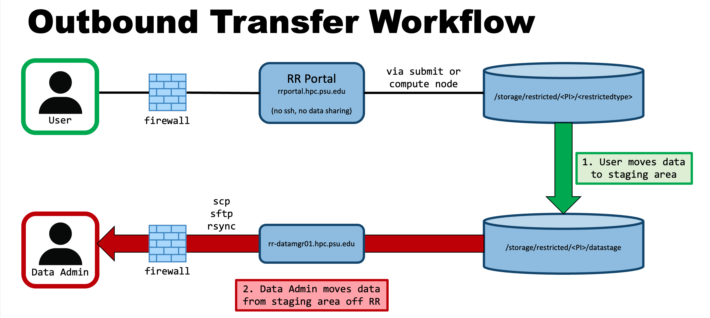
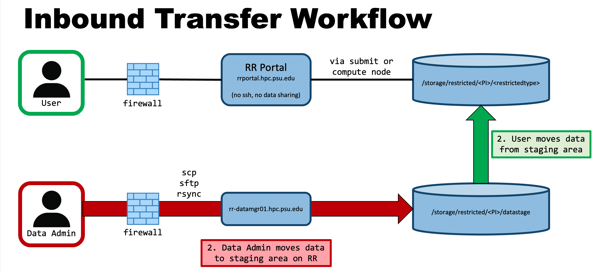

# Roar Restricted Addendum

Roar Restricted (RR) is configured for the handling of restricted data and is dedicated to serving the small portion of researchers who must comply with more stringent data storage standards.
Restricted group storage on RR is provided on an as-needed basis to a principal investigator (PI) specifically handling restricted data.

Most of the material within this ICDS User Guide is common to both Roar Collab (RC) and RR, but some sections specifically refer to RC.
This [Roar Restricted Addendum](06_RoarRestricted.md) specifically addresses items unique to RR. 

[RR system specifications](01_Overview.md/#roar-restricted) and [RR storage locations](04_HandlingData.md/#roar-restricted-storage) are described within the linked Roar User Guide sections.

## Accessing Roar Restricted

RR accounts are only granted to individuals that require access to an active restricted storage allocation. 
Also, RR does offer a free compute account, so users must submit jobs to a compute account provided by a paid compute allocation.

To request an account on RR, a user must complete the [Account Request](https://accounts.aci.ics.psu.edu) form and then send an email to **icds@psu.edu** with the user's PSU access account ID, the restricted storage owner's name and access account ID, and an indication that they are requesting an account on RR.
Non-faculty accounts require approval from a faculty/PI sponsor. 
The user will then be assigned an RR training module.
To gain and retain access to RR, users must complete the RR training module via [Penn State LRN](https://lrn.psu.edu) which is required by the Office of Information Security (OIS) to maintain compliance with the Authority to Operate (ATO).
The account creation process takes about 48 hours after faculty/PI sponsor approval.

## Connecting

Users can only connect to RR via the [RR Portal](https://rrportal.hpc.psu.edu) ([rrportal.hpc.psu.edu](https://rrportal.hpc.psu.edu)).
RR is only accessible when connecting either via the Penn State network or via Penn State GlobalProtect VPN. 
GlobalProtect can be downloaded from [it.psu.edu/software](https://www.it.psu.edu/software/) and [additional configuration instructions](https://pennstate.service-now.com/sp?id=kb_article_view&sysparm_article=KB0013431&sys_kb_id=24f7cdd9dbd7e0d02c4f9e74f3961967&spa=1) are available from Penn State IT.

## Handling Data 

RR is designed to limit the risk of accidental data leaks, so ICDS is implementing a data transfer process that relies on a PI-appointed data administrator to transfer data to/from RR.
PIs and any appointed data administrators are responsible for the data and any transfers conducted via the data manager node.
PIs can request access to the file transfer capability via the Data Transfer Access Form. 
PIs and any data administrators must attest annually that they still need access to the data manager node.

To request data administrator access, a user must email **icds@psu.edu** with the faculty/PI sponsor copied. The faculty/PI sponsor must approve that the user should be granted data administrator status. 
Upon faculty/PI confirmation, the user must submit the [Data Transfer System Access Request Form](https://pennstate.service-now.com/sp?id=sc_cat_item&sys_id=1bd490a71bfa0e10bd31ed74bd4bcb77). 
The user will then be added to the necessary groups on RR to grant them access to the data manager nodes.

To comply with restricted data storage standards, Roar Restricted (RR) must adhere to a Secure Data Transfer Management Model. 
Users cannot transfer data on or off RR, but they can move data between the main restricted group storage and the group's staging area. 
Data administrators may transfer data on and off RR via the data manager node using a group's staging area. 
While conducting transfers, data administrators are responsible for adhering to the data management standards and guidelines.
Transfers are conducted using the process outlined in the diagrams below.

