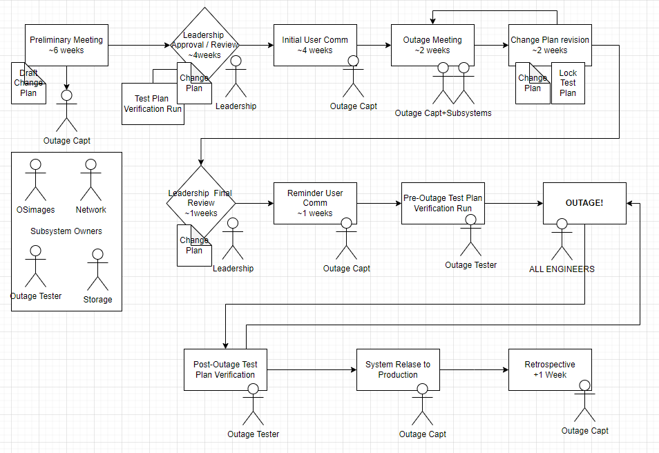

# System Outages

ICDS engineers have updateed and expanded the outage protocol to improve recovery time and expand testing. 

The outage workflow has been updated to make use of serviceNOW and provide tracking.

 - changes are throughly documented
 - includes a review by leadership to understand potential impacts
 - system test plan that includes client-submitted use cases

## Post Outage Test

Post outage ICDS Engineers go through a series of test to show basic connectivity and functionaloty of services (i.e. job submission, SLURM, OOD portal, Globus access, science gateways). This will be followed by application test detailed below. 

Includes sample test for the following applications:

 - C
 - alltest (MPI network latency mapping test)
 - bash / SLURM submission testing
 - comsol
 - cpp
 - fluent
 - fortran
 - gpu nbody
 - gromacs
 - java
 - julia
 - mathematica
 - matlab
 - py_array
 - python
 - r
 - starccm

Includes user test for the following applications: 

 - Ansys Fluent job
 - MPI fluid solver
 - Gaussian
 - OpenFOAM
 - COMSOL
 - MATLAB sine_wave 

**Your input is valuable**. At the conclusion of every outage, ICDS engineers run extensive use case tests to ensure that the system will work as expected. If your team runs your own post outage tests or if you have ideas for tests you’d like ICDS engineers to run, [please let us know.](mailto:icds@psu.edu?subject=Post-Outage%20Testing%20Feedback)
 
 
## Planned Outage 2025-05-14

#### Outage Duration

 - Planned May 14, 2025 17:00 -- May 15, 2025 17:00
 - Actual  May 14, 2025 17:00 -- May 15, 2025 17:03

#### Plan of Action

 - STORAGE: troubleshoot power redundancy configuration on RC group storage 
   **Complete**

 - STORAGE: continue to troubleshoot RDMA timeout issues on RC group storage
   **vendor logs collected, complete for now, nodes using TCP**

 - STORAGE: Globus software update from 5.4.80 to 5.4.85. **Complete**

 - NETWORK: resolve hardware error on Interconnect Switch **Complete**

 - SCHEDULER: Slurm Update from 24.05.4 to 24.05.8 
   **Complete**

 - Operating System Image and Package updates **Complete**
    - final package list: [image_pkg_update_list_2025-05-13.txt](../img/image_pkg_update_list_2025-05-13.txt)
    - added libjpeg-turbo for unlisted dependency 
    
 - Workflow: update symlink at /storage/icds/tools/sw/firefox to point to updated firefox. **Complete**

 - Cluster Admin Node Updates **Complete**

 - Re-sync the software stack between RC and RR **Complete**

 - License Updates: MATLAB, COMSOL, Mathematica, tecplot **Complete**

#### Known issues: 

 - Schrodinger license manager fails to load **Investigating**

 - Mathematica license shows as expiring May 30 **Investigating**

#### ServiceNow Links

ServiceNow Form

- RITM0362423 [RITM0362423](https://pennstate.service-now.com/nav_to.do?uri=sc_req_item.do%3Fsys_id=9dc5c7af47302e94fb179df4126d439c%26sysparm_stack=sc_req_item_list.do%3Fsysparm_query=active=true)

- CHG0121515 [CHG0121515](https://pennstate.service-now.com/nav_to.do?uri=change_request.do%3Fsys_id=39c50baf47302e94fb179df4126d436f%26sysparm_stack=change_request_list.do%3Fsysparm_query=active=true)
