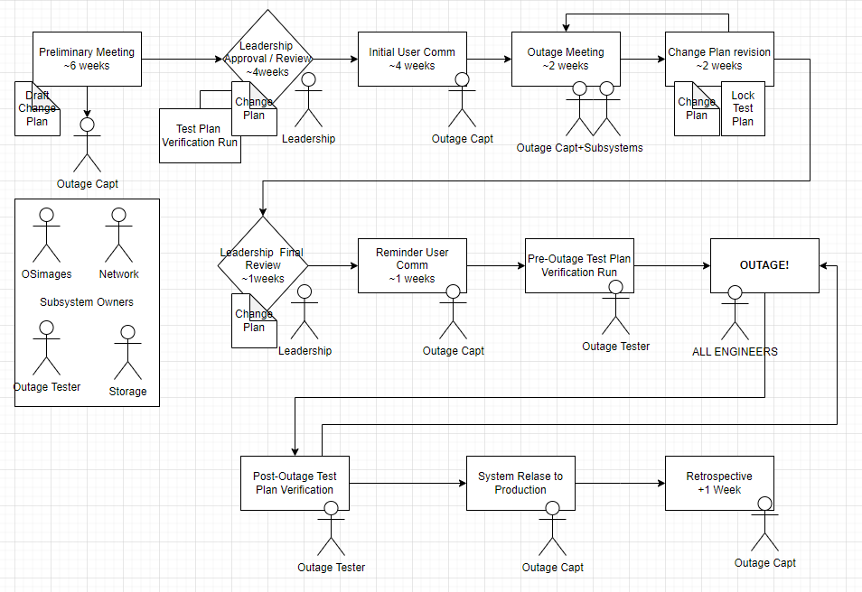

# System outages

ICDS engineers have updateed and expanded the outage protocol to improve recovery time and expand testing. 

The outage workflow has been updated to make use of serviceNOW and provide tracking.

 - changes are throughly documented
 - includes a review by leadership to understand potential impacts
 - system test plan that includes client-submitted use cases

## Post outage test

Post outage ICDS Engineers go through a series of test to show basic connectivity and functionaloty of services (i.e. job submission, Slurm, OOD portal, Globus access, science gateways). This will be followed by application test detailed below. 

Includes sample test for the following applications:

 - C
 - alltest (MPI network latency mapping test)
 - bash / Slurm submission testing
 - comsol
 - cpp
 - fluent
 - fortran
 - gpu nbody
 - gromacs
 - java
 - julia
 - mathematica
 - matlab
 - py_array
 - python
 - r
 - starccm

Includes user test for the following applications: 

 - Ansys Fluent job
 - MPI fluid solver
 - Gaussian
 - OpenFOAM
 - COMSOL
 - MATLAB sine_wave 

**Your input is valuable**. At the conclusion of every outage, ICDS engineers run extensive use case tests to ensure that the system will work as expected. If your team runs your own post outage tests or if you have ideas for tests you’d like ICDS engineers to run, [please let us know.](mailto:icds@psu.edu?subject=Post-Outage%20Testing%20Feedback)

 
## Planned outage 2026-01-08

#### Outage duration

 - Planned Jan 08, 2026 17:00 -- Jan 10, 2026 17:00
 - Actual  Jan 08, 2026 17:00 -- Jan 09, 2026 19:44

#### Plan of action

 - DATA CENTER: Power circuit and UPS maintenance
 - STORAGE: Migrate /scratch **Complete**
    - Enforcing quota on /scratch on Vast storage.
    - Previous scratch mounted at /oldscratch on globus and submit nodes through February

 - SCHEDULER: Reconfigure open usage **Complete**
    - The open partition and any jobs in the open partition were removed
    - Jobs submitted to "open" partition will be pushed to "basic" partition
    - Limits of 10 credits/user for January open account.  PIs can apply for READ credits.

 - CLUSTER: reconfigure node support **Complete**
    - Older nodes only used by the open partition were removed from Slurm configuration
    
 - Operating System: Security and system software updates **Complete**
    - draft package list:  [image_pkg_update_list_2026-01-08.txt](../img/image_pkg_update_list_2026-01-08.txt)
 
## Planned outage 2025-08-13

#### Outage duration

 - Planned Aug 13, 2025 17:00 -- Aug 14, 2025 17:00
 - Actual  Aug 13, 2025 17:00 -- Aug 14, 2025 14:10

#### Plan of action

 - STORAGE: update RC group storage firmware, enable RDMA functions **Complete**

 - STORAGE: Globus software update from 5.4.85 to 5.4.87 **Complete**

 - SCHEDULER: **Complete**
    - Slurm Update to 24.11 
    - Implement changes related to instructional use 
    - Modify accounts with "atype" tag in description field

 - Open OnDemand: **Complete**
    - upgrade to v4 [link](https://discourse.openondemand.org/t/open-ondemand-4-0-release/3959/5)
    - Improved performance fixes
    - Shutdown rcportal (old name), link to portal.hpc.psu.edu
    - Renew SSL Certificate

 - Operating System Image and Package updates **Complete**
    - draft package list:  [image_pkg_update_list_2025-08-13.txt](../img/image_pkg_update_list_2025-08-13.txt)
    - Remove java-11-openjdk
    - Add RDMA NFS support (deps on storage updates)

 - NETWORK: software updates **Complete**

 - Data Center Power Maintanace **Complete**

 - VMWare backend: update infrastructure software, enable iSCSI features **Complete**

 - Cluster Admin Node Updates **Complete**

 - Re-sync the software stack between RC and RR **Complete**

 - Adjust storage for groups impacted by naming convention **Complete**

#### Known issues 

Julia - GPU Users: 

Updates to CUDA drivers made during this outage will require users to rebuild the `.julia` folder in their home directories. Users with customizations should rebuild this folder “manually,” while simply deleting the folder will cause it to be rebuilt automatically in a default state. ICDS recommends saving a copy of your `.julia` folder before deleting or editing. For assistance, contact Client Support at <icds@psu.edu>.

#### ServiceNow links

ServiceNow form

- [RITM0373685 ](https://pennstate.service-now.com/now/nav/ui/classic/params/target/sc_req_item.do%3Fsys_id%3D8b87bbaac3aae2d028753df905013122%26sysparm_stack%3D%26sysparm_view%3D)

## Planned outage 2025-05-14

#### Outage duration

 - Planned May 14, 2025 17:00 -- May 15, 2025 17:00
 - Actual  May 14, 2025 17:00 -- May 15, 2025 17:03

#### Plan of action

 - STORAGE: troubleshoot power redundancy configuration on RC group storage 
   **Complete**

 - STORAGE: continue to troubleshoot RDMA timeout issues on RC group storage
   **vendor logs collected, complete for now, nodes using TCP**

 - STORAGE: Globus software update from 5.4.80 to 5.4.85. **Complete**

 - NETWORK: resolve hardware error on Interconnect Switch **Complete**

 - SCHEDULER: Slurm Update from 24.05.4 to 24.05.8 
   **Complete**

 - Operating System Image and Package updates **Complete**
    - final package list: [image_pkg_update_list_2025-05-13.txt](../img/image_pkg_update_list_2025-05-13.txt)
    - added libjpeg-turbo for unlisted dependency 
    
 - Workflow: update symlink at /storage/icds/tools/sw/firefox to point to updated firefox. **Complete**

 - Cluster Admin Node Updates **Complete**

 - Re-sync the software stack between RC and RR **Complete**

 - License Updates: MATLAB, COMSOL, Mathematica, tecplot **Complete**

 - COMSOL configuration change to set license time out to 1 hour of inactivity. Inactivity is defined as no mouse or keyboard activity with the gui **or** active COMSOL model running. **Complete**

#### Known issues: 

 - Schrodinger license manager fails to load **resolved**

 - Mathematica license shows as expiring May 30 **resolved**

#### ServiceNow links

ServiceNow Form

- [RITM0362423](https://pennstate.service-now.com/nav_to.do?uri=sc_req_item.do%3Fsys_id=9dc5c7af47302e94fb179df4126d439c%26sysparm_stack=sc_req_item_list.do%3Fsysparm_query=active=true)

- [CHG0121515](https://pennstate.service-now.com/nav_to.do?uri=change_request.do%3Fsys_id=39c50baf47302e94fb179df4126d436f%26sysparm_stack=change_request_list.do%3Fsysparm_query=active=true)

