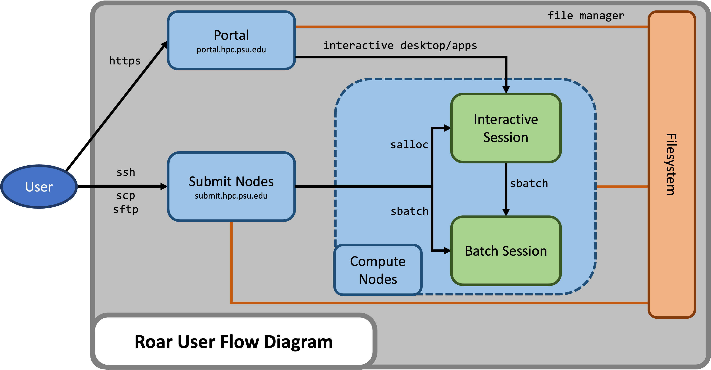

# System overview

Compute clusters like Roar serve many purposes:

- **number crunching**, much bigger and faster than a laptop
- **batch compute jobs**, submitted and performed later
- **interactive computing**, on the equivalent of a powerful workstation
- **large-scale storage** and access of data files

## Architecture

Roar consists of different parts, connected together by networks:

- **users** of the cluster, who connect to either
- **the Portal**, for interactive computing, or
- **submit nodes**, to prepare and submit jobs;
- **file storage** for user files, plus
- **scratch storage** for temporary files; and 
- **compute nodes**, of several different types.

Additional information on the Roar Collab system configuration can be found in 
[Compute Hardware](compute-hardware.md)

## Accounts

To log on to Roar, you need a [login account](../getting-started/connecting.md/#roar-account-creation).
You can use free [READ credits](../accounts/read-credits.md), 
given to all users, which can be spent on any of Roar's hardware.
If your compute needs grow beyond what free credits can pay for,
you need either a paid [credit account](../accounts/paid-resources.md), 
or a paid [allocation](../accounts/paid-resources.md).

With credit accounts, you pay only only the compute resources you use,
and can use any type of nodes you need.
However, if you require prompt access to specific hardware,
you can opt for an allocation ---
in which you reserve specific hardware,
and pay whether or not you use the compute time.

## Partitions

A partition is a group of similar compute nodes that your job can run on. 

Nodes on Roar are grouped into four different hardware partitions:

- **basic (4 GB/core)** – CPU nodes without Infiniband, for jobs that fit on a single node.
- **standard (8 GB/core)** – CPU nodes with Infiniband (essential for multinode jobs).
- **himem (20 GB/core)** – CPU nodes with extra memory, for memory-intensive jobs.
- **interactive** – Nodes with graphics cards, that service the Portal.

All GPU nodes are available in the standard partition.  
In addition, there is a partition not associated with specific hardware:

- **sla-prio** - For paid allocations, with whatever hardware the allocation includes.

Partitions are specified when launching a [Portal](../running-jobs/portal.md) session,
an [interactive job](../running-jobs/interactive-jobs.md), 
or a [batch job](../running-jobs/batch-jobs.md).

## Quality of Service (QOS)

A partition is *where* your job runs; Quality of Service (QOS) is *how* your job runs.  
Default QOS settings are applied automatically based on the partition you 
choose. 

Roar has four QoS :  normal, debug, express, and interactive.  
Each serves a different purpose, and has different restrictions.

| QOS | description | restrictions |
| ---- | ---- | ---- |
| normal | for "normal" jobs | runtime < 14 days |
| debug	| for testing, debugging, and code compilation | one job per user   runtime < 4 hours |
| express | for rush jobs;   **charges 2x price** | runtime < 14 days |
| interactive | for Portal jobs requiring graphical support | one job per user   4 core and 64 GB max   runtime < 48 hours |
